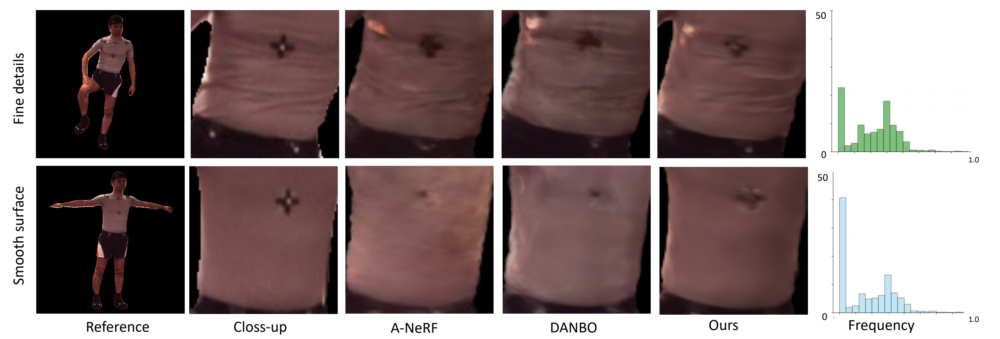

# Pose Modulated Avatars from Video

## [Paper](https://openreview.net/pdf?id=5t44vPlv9x) | [Project Page](https://chunjinsong.github.io/PM-Avatars/)

### Pose Modulated Avatars from Video
[Chunjin Song](https://chunjinsong.github.io/), [Bastian Wandt](https://bastianwandt.de/), and [Helge Rhodin](http://helge.rhodin.de/) \
ICLR 2024

 

## Getting Started
### Setup environment
```
conda create -n pmavatar python=3.8
conda activate pmavatar

# install pytorch for your corresponding CUDA environments
pip install torch

# install pytorch3d: note that doing `pip install pytorch3d` directly may install an older version with bugs.
# be sure that you specify the version that matches your CUDA environment. See: https://github.com/facebookresearch/pytorch3d
pip install pytorch3d -f https://dl.fbaipublicfiles.com/pytorch3d/packaging/wheels/py38_cu102_pyt190/download.html

# install other dependencies
pip install -r requirements.txt

```

### Instruction

To train the model, run
```
python launch.py --config-name=[name_of_config] basedir=[path_to_log_directory] expname=[name_of_log] dataset=[name_of_dataset_config]
```

For example, to run pmavatar on `h36m` dataset, runs
```
python launch.py --config-name=pm_avatar basedir=logs expname=pmavatar_h36m dataset=h36m_zju
```
You can check `configs/pm_avatar.yaml` and `configs/dataset/h36m_zju.yaml` for the details.


To render, you can run
```
python run_render.py --config-name=[config_name] model_config=[config_from_your_model_log_dir] output_path=[path_to_output]
```
The details config for rendering is in `configs/render/`.

For example, assuming you have trained a PM-Avatar model with log file saved in `log/pmavatar/`, then you can run
```
python run_render.py --config-name=h36m_zju model_config=log/pmavatar/config.yaml ckpt_path=log/pmavatar/latest.th output_path=log/danbo/rendered
```

### Dataset

You can find dataset configuration in `configs/dataset`.

We are not allowed to share the pre-processed data for H3.6M and MonoPerfcap due to license terms. We follow [A-NeRF](https://github.com/LemonATsu/A-NeRF), [DANBO](https://github.com/LemonATsu/DANBO-pytorch)
to process the data. You can refer to the code in `data_processing/` to process the data.

## Acknowledgement
We have used codes from other great research work, including [A-NeRF](https://github.com/LemonATsu/A-NeRF), [DANBO](https://github.com/LemonATsu/DANBO-pytorch).

## Citation
```
@inproceedings{
     song2024pose,
     title={Pose Modulated Avatars from Video},
     author={Chunjin Song and Bastian Wandt and Helge Rhodin},
     booktitle={The Twelfth International Conference on Learning Representations},
     year={2024},
     url={https://openreview.net/forum?id=5t44vPlv9x}
    }
```